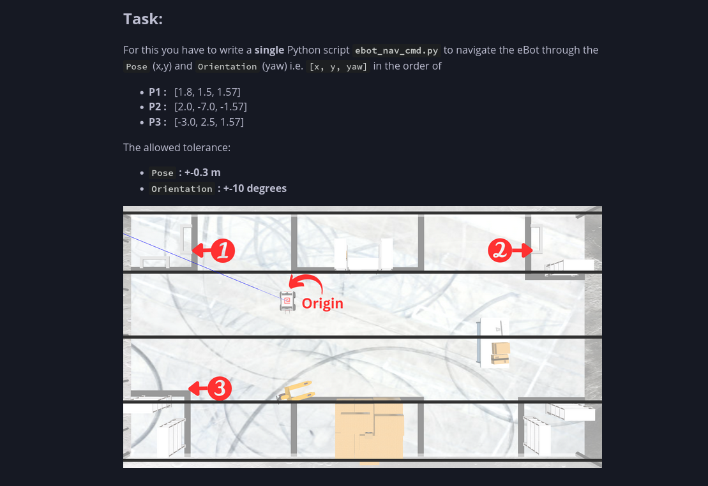

# Demo

Youtube Link : https://youtu.be/7A9FpvXK9tA

## Task

## Some changes before you build the package
* Changes in SkyX (Gazebo)
  *  `SkyX_Moon.fragment` file located at /usr/share/gazebo-11/media/skyx/ needs to be updated with the one added here- https://github.com/eYantra-Robotics-Competition/eyrc-23-24-cl/tree/amit/eyantra_warehouse/config.
  *  `SkyX_Moon.png` file located at /usr/share/gazebo-11/media/skyx/ needs to be updated with the one added here- https://github.com/eYantra-Robotics-Competition/eyrc-23-24-cl/tree/amit/eyantra_warehouse/config.

  * Install xacro using `sudo apt install ros-humble-xacro`

  * Install pip3 using `sudo apt install python3-pip`

  * Install tf_transformations `sudo apt install ros-humble-tf-transformations`

  * Install transforms3d `sudo pip3 install transforms3d`

## To spawn the robot in the Gazebo Simulator, use-
`ros2 launch ebot_description ebot_gazebo_launch.py`

## To control the robot using keyboard, use-
`ros2 run teleop_twist_keyboard teleop_twist_keyboard`

## To run SLAM and Navigation and visualize in Gazebo and Rviz Simulator, use-
- Spawn ebot in e-yantra warehouse world - 

`ros2 launch ebot_description ebot_gazebo_launch.py`

- Navigate ebot on generated map using 2D Nav Goal in Rviz2 -

`ros2 launch ebot_description ebot_bringup_launch.py `

- Visualize costmaps in rviz -

`ros2 run rviz2 rviz2 -d $(ros2 pkg prefix nav2_bringup)/share/nav2_bringup/rviz/nav2_default_view.rviz`

